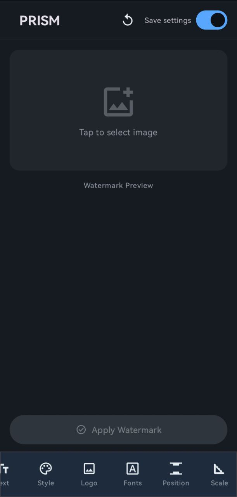

# Prism - Watermark Editor

Quickly add watermarks and easily customize them!
A simple Android app for adding watermarks to photos.

---

## 🖼️ Watermark Examples

---

## ✨ What can I customize in a watermark?

- Basic text fonts and EXIF data
- Enable/disable display of EXIF information
- Device model location: separate text or EXIF data
- Select watermark position: top, bottom, left, or right
- Select a logo, add and save your own
- Enable/disable the logo
- Select a watermark theme (background): light or dark
- Customize element colors via hex: background color, text color, EXIF data color
- Select a standard watermark template or create your own via JSON code
- Scalability - what percentage of the photo should the watermark occupy (from 7.5% to 45%)

## 🎨 Customize Watermark Styles

Create and customize your own watermark templates with ease.

Follow this guide: [Custom Watermarks](https://markus1394.github.io/Prism/)

## 🛠️ Requirements

- 🤖 Android 9+
- 📱 At least 20 MB of free space

## 📥 Installation

1. Download the latest APK from [GitHub Releases](https://github.com/Markus1394/Prism/releases)
2. Enable "Installation from Unknown Sources" on your device
3. Open the APK and install the app

---
## 📄 License

This project is licensed under the MIT License.